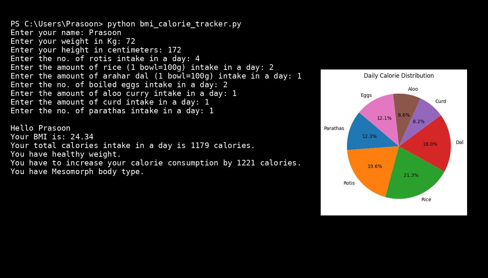

# 🥗 BMI & Daily Calorie Intake Analyzer (Python)

A beginner-friendly Python project that calculates **Body Mass Index (BMI)**, analyzes **daily calorie intake**, and visualizes food-wise calorie distribution using a **pie chart**.  
This project demonstrates the practical use of **Python fundamentals, conditional logic, mathematical computation, and data visualization**.

---

## 📌 Project Overview

This program:
- Takes user input for height, weight, and daily food consumption
- Calculates BMI using standard formula
- Estimates total daily calorie intake based on food items
- Classifies health status and body type
- Displays calorie distribution using a pie chart

This project is ideal for:
- Python beginners
- Freshers building logic-based projects
- Students preparing for Data Science / ML learning paths

---

## 🛠️ Technologies Used

- **Python 3**
- **Matplotlib** – for pie chart visualization
- **Basic Mathematics**
- **Conditional Statements**
- **User Input Handling**

---

## 📊 Features Implemented

- ✅ BMI Calculation  
- ✅ Health Classification (Underweight / Healthy / Overweight / Obese)  
- ✅ Daily Calorie Intake Calculation  
- ✅ Food-wise Calorie Mapping  
- ✅ Body Type Identification  
- ✅ Pie Chart Visualization  
- ✅ VS Code–style terminal output  

---

## 📂 Food Items Considered

| Food Item      | Calories (approx.) |
|----------------|--------------------|
| Paratha        | 150 kcal           |
| Roti           | 60 kcal            |
| Rice (100g)    | 130 kcal           |
| Arhar Dal      | 220 kcal           |
| Curd           | 100 kcal           |
| Aloo Curry     | 105 kcal           |
| Boiled Egg     | 74 kcal            |

---

## 🧮 BMI Formula Used

```
BMI = Weight (kg) / (Height (m))²
```

---

## 📸 Sample Output

### Terminal Output + Visualization



---

## 🚀 Future Enhancements

- Add NumPy for scalable calculations
- Improve BMI condition logic
- Add calorie recommendations based on age & gender
- Export report as PDF
- Add GUI using Tkinter or Streamlit

---

## 👤 Author

**Prasoon Kumar**  
Aspiring Data Scientist / ML Engineer  
📌 Passionate about Python, Data Science & Machine Learning

---

## ⭐ Acknowledgment

This project was built as a learning exercise to strengthen core Python concepts and apply them to real-world health data analysis.

If you find this useful, don’t forget to ⭐ the repository!
=======
# Python_Project
Here you can find some python projects.
