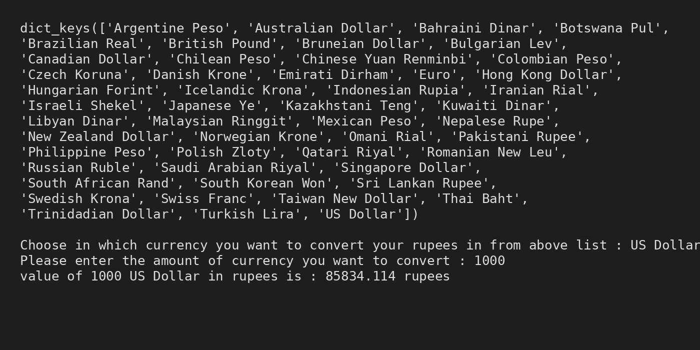

# 💱 Indian Rupee Currency Converter (Python)

A simple **Python-based currency converter** that converts **Indian Rupees (INR)** into various international currencies using predefined exchange rates.  
This project is beginner-friendly and demonstrates the use of **lists, dictionaries, user input, and basic arithmetic** in Python.

---

## 📌 Project Description

This program:
- Stores a list of international currencies
- Stores corresponding conversion values
- Uses `zip()` to create a dictionary
- Takes user input for:
  - Target currency
  - Amount
- Converts Indian Rupees into the selected foreign currency
- Displays the result in the terminal

The output is shown in a **VS Code dark-theme style terminal**, making it suitable for GitHub showcasing.

---

## 🛠️ Technologies Used

- **Python 3**
- Core Python concepts:
  - Lists
  - Dictionary
  - `zip()`
  - User input
  - Conditional statements
  - String formatting

---

## 📂 Project Structure

```
currency-converter/
│
├── Project.py
├── Output.jpg
└── README.md
```

---

## 🧪 Sample Output

```
dict_keys(['Argentine Peso', 'Australian Dollar', 'Bahraini Dinar', ... , 'US Dollar'])

Choose in which currency you want to convert your rupees in from above list : US Dollar
Please enter the amount of currency you want to convert : 1000
value of 1000 US Dollar in rupees is : 85834.114 rupees
```

📸 **Output Screenshot (VS Code Dark Theme):**



---

## 🎯 Learning Outcomes

By working on this project, you will learn:
- How to map related data using `zip()`
- How dictionaries enable fast lookups
- How to take and validate user input
- How to format outputs clearly
- How basic currency conversion logic works

---

## 🚀 Possible Improvements

- Reverse conversion (Foreign Currency → INR)
- Case-insensitive currency input
- Live exchange rates using APIs
- Function-based modular code
- Exception handling for invalid input

---

## 👨‍💻 Author

**Prasoon Kumar**  
Aspiring Data Scientist / ML Engineer  

---

## ⭐ Acknowledgment

This project is created for **learning and practice purposes**.
