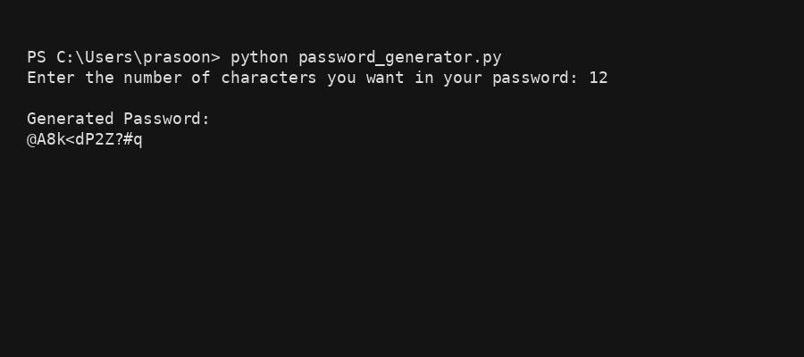

# 🔐 Random Password Generator (Python)

A simple and beginner-friendly **Random Password Generator** built using Python.
This project demonstrates how to generate secure passwords using different character sets such as:

- Lowercase letters
- Uppercase letters
- Digits
- Special characters

The project is ideal for **Python beginners**, **GitHub portfolio projects**, and **interview demonstrations**.

---

## 🚀 Features
- Generates passwords of user-defined length
- Uses multiple character groups
- Randomized output every time
- Simple and readable Python code
- Beginner-friendly logic

---

## 🛠️ Technologies Used
- Python 3
- Built-in libraries (`random`)

---

## 📂 Project Structure
```
password-generator/
│
├── Project.py
├── Output.jpg
└── README.md
```

---


## 🖥️ Sample Output




---

## 📌 Example

```
Enter the number of characters you want in your password: 12
Generated Password:
@A8k<dP2Z?#q
```

---

## 🎯 Learning Outcomes
- Working with lists in Python
- Understanding random selection
- Handling user input
- Basic error handling using try-except

---

## 🤝 Contributing
Feel free to fork this repository and improve the logic, security, or UI.

---

## 📜 License
This project is open-source and free to use for learning purposes.

---

⭐ If you like this project, don't forget to star the repository!
