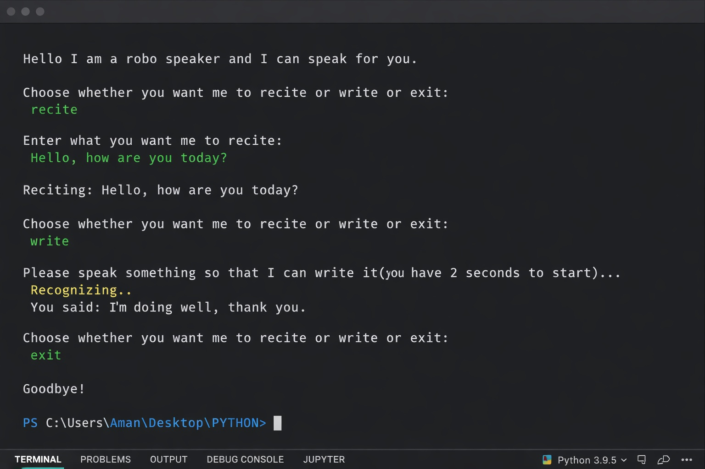

# 🤖 Robo Speaker & Speech-to-Text (Python)

A beginner-friendly Python project that demonstrates **Text-to-Speech (TTS)** and **Speech-to-Text (STT)** using popular libraries like `pyttsx3` and `speech_recognition`.

This project allows users to:
- 🗣️ **Recite** text using a robo voice  
- ✍️ **Write** spoken words by converting speech into text  
- ❌ Exit the program interactively  

---

## 🚀 Features

- Text-to-Speech using `pyttsx3`
- Speech Recognition using Google Speech API
- Interactive command-line interface
- Error handling for microphone timeout and unclear speech
- Clean and beginner-readable Python code

---

## 🛠️ Technologies Used

- Python 3.x
- `pyttsx3`
- `speech_recognition`
- `pyaudio` (for microphone access)

---

## 📂 Project Structure

```
Robo-Speaker/
│
├── Project.py
├── output.jpg
└── README.md
```

---

## 🖥️ Sample Output



---

## 🧠 Learning Outcomes

- Working with external Python libraries
- Handling user input in loops
- Using microphones and audio input
- Basic error handling
- Building real-world beginner projects

---

## 🌱 Future Enhancements

- Save recognized speech to a text file
- Add language selection
- Add male/female voice toggle
- GUI version using Tkinter

---

## 🙌 Author

**Prasoon Kumar**  
Aspiring Data Scientist / ML Engineer  

---

⭐ If you like this project, don’t forget to star the repo!
