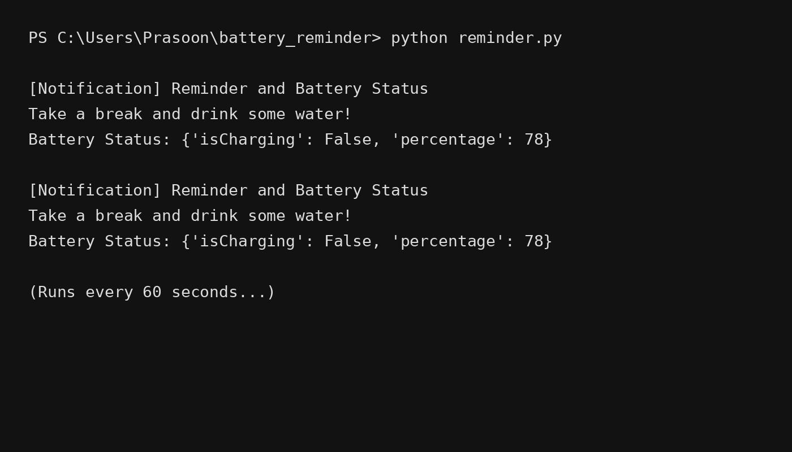

# 🔋 Battery Reminder & Health Notification App (Python)

A simple yet practical Python application that sends desktop notifications reminding you to take breaks, drink water, and displays your system's battery status.

---

## 🚀 Features

- ⏰ Periodic desktop notifications (every 60 seconds)
- 💧 Health reminder to drink water
- 🔋 Displays real-time battery status
- 🌙 Clean VS Code–style terminal output (for GitHub showcase)
- 🪶 Lightweight and beginner-friendly

---

## 🛠️ Tech Stack

- Python 3.x
- Plyer library
- Time module

---

## 📂 Project Structure

```
battery-reminder/
│
├── Project.py        # Main Python script
├── Output.jpg         # VS Code dark terminal output screenshot
└── README.md          # Project documentation
```

---

## 📌 How It Works

The program runs in an infinite loop and:
1. Fetches the system battery status using `plyer.battery`
2. Displays a desktop notification
3. Waits for 60 seconds
4. Repeats the process

---

## ▶️ Code Snippet

```python
from plyer import battery, notification
import time

while True:
    status = battery.status
    notification.notify(
        title="Reminder and Battery Status",
        message=f"Take a break and drink some water! Battery Status: {status}",
        timeout=5
    )
    time.sleep(60)
```

---

## 🖥️ Sample Output




---

## ⚠️ Notes

- Battery status may return `None` on desktop PCs without a battery
- Best supported on Windows and Linux
- Notifications depend on OS settings

---

## 🌟 Use Cases

- Beginners learning Python automation
- Health & productivity reminders
- Resume / portfolio projects
- GitHub showcase projects

---

## 🙌 Author

**Prasoon Kumar**  
Aspiring Data Scientist / ML Engineer  

---

⭐ If you like this project, give it a star on GitHub!
